# 基于springboot的毕业设计系统

---
### 👉作者QQ ：1556708905 微信：zheng0123Long (支持定制修改、部署调试、定制毕设)

### 👉接网站建设、小程序、H5、APP、各种系统等

---

#### 介绍

在当今高等教育体系中，毕业设计作为检验学生综合能力的重要环节，其管理和执行效率直接影响到教学质量和学生成果。然而，传统的手工管理方式往往存在信息更新不及时、流程繁琐、数据易丢失等问题。为了解决这些问题，我们开发了一个基于Spring Boot的毕业设计管理系统。该系统通过信息化手段，实现了毕业设计全过程的精细化管理，提高了管理效率，保证了数据的准确性和实时性。

本系统针对毕业设计管理中的不同角色设计了不同的功能模块，以满足各方的需求。系统主要角色包括管理端、教师端和学生端，每个角色都有其特定的功能和权限，确保了系统的安全性和易用性。

#### 技术栈

后端技术栈：Springboot+Mysql+Maven

前端技术栈：Vue+Html+Css+Javascript+ElementUI

开发工具：Idea+Vscode+Navicate

#### 系统功能介绍

管理端  
个人中心：管理员可以查看和修改个人信息，包括账号设置、密码修改等。    
管理员管理：对系统管理员进行增删改查，分配不同权限，确保系统安全。  
基础数据管理：维护系统中所需的基础数据，如专业信息、学院信息等。  
教师管理：对教师信息进行维护，包括教师信息的增删改查，分配教师权限。  
课题信息管理：发布和管理毕业设计课题，包括课题的增删改查、审核等。  
选题申请管理：处理学生的选题申请，进行审批和分配。  
课题任务管理：监控课题进度，管理课题相关的任务和时间节点。  
最终成绩管理：录入和管理学生的毕业设计最终成绩。  
公告信息管理：发布系统公告，通知相关事宜。  
学生管理：管理学生信息，包括学生信息的增删改查。  

教师端  
个人中心：教师可以查看和修改个人信息。  
课题信息管理：发布和管理自己的毕业设计课题。  
选题申请管理：处理学生的选题申请，进行审批。  
课题任务管理：监控自己所负责课题的进度，分配和管理任务。  
最终成绩管理：录入和管理学生的毕业设计成绩。  
公告信息管理：发布课程或课题相关的公告。  
学生管理：查看和管理自己负责的学生信息。  

学生端  
个人中心：学生可以查看和修改个人信息。  
课题信息管理：查看已发布的毕业设计课题信息。  
选题申请管理：提交和管理自己的选题申请。  
课题任务管理：查看课题进度和任务，提交任务成果。  
最终成绩管理：查看自己的毕业设计最终成绩。  
公告信息管理：查看系统公告和课程公告。  

#### 系统作用

本系统的开发和应用，极大提升了毕业设计管理的效率和水平。通过信息化手段，实现了毕业设计全过程的精细化管理，确保了数据的准确性和实时性。具体作用如下：

提高管理效率：系统自动化处理大量重复性工作，减轻了管理人员的工作负担。  
增强数据安全性：系统采用先进的数据加密和备份技术，确保数据的安全性和可靠性。  
提升教学质量：通过实时监控课题进度和任务完成情况，教师可以更好地指导学生，提升教学质量。  
方便学生使用：学生可以通过系统随时查看课题信息、提交任务成果和查看成绩，提高了学习的自主性和便利性。  

#### 系统功能截图

代码结构

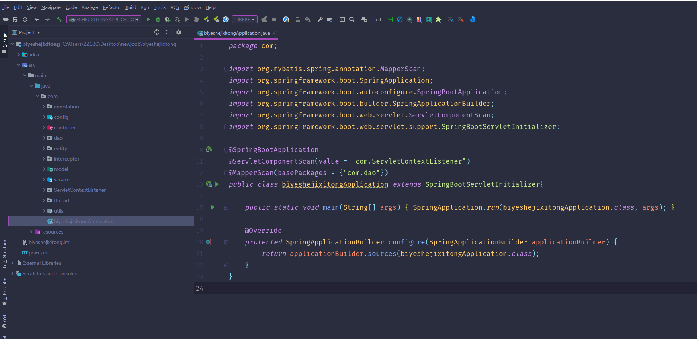

数据库表

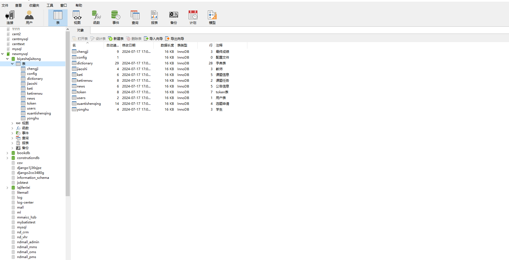

登录

管理员端基础数据管理

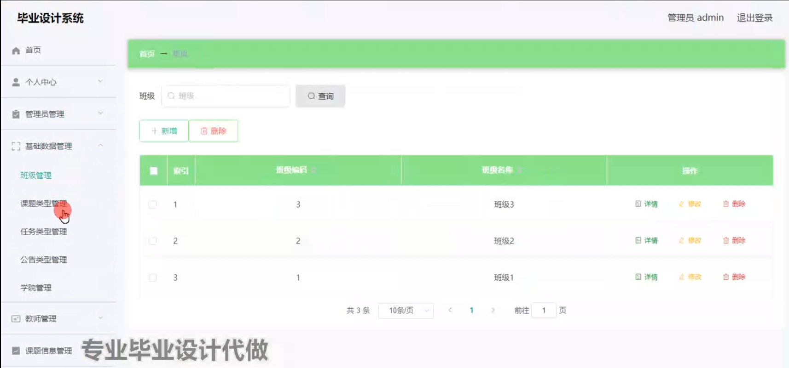

教师管理

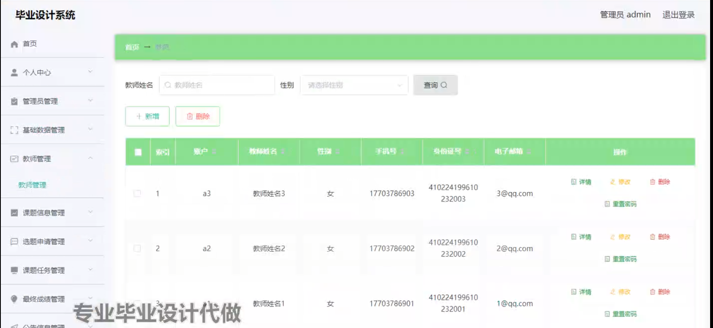

课程信息管理

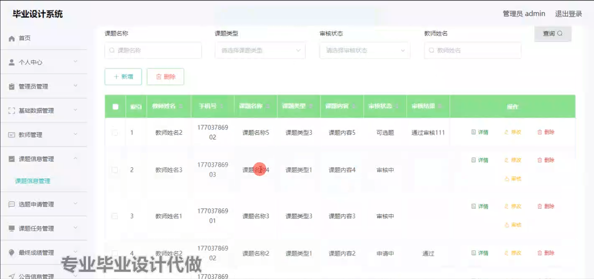

选题申请管理

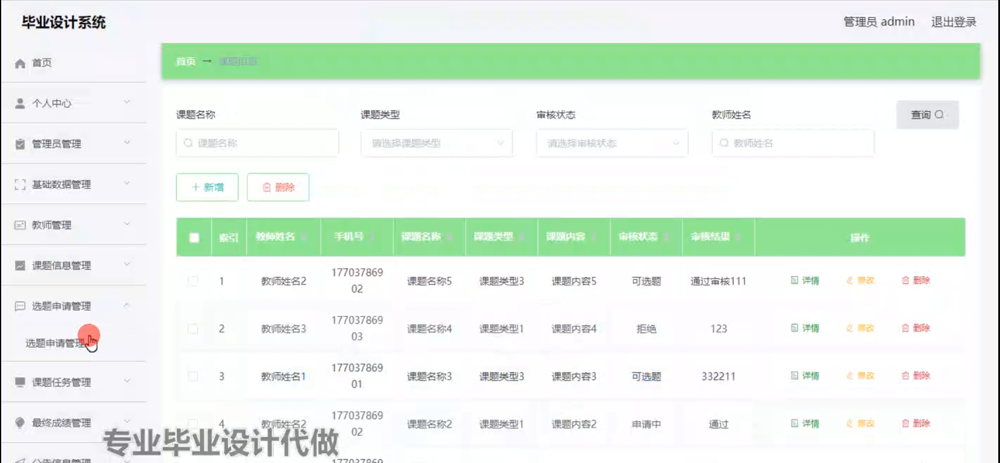

学生端课程信息管理

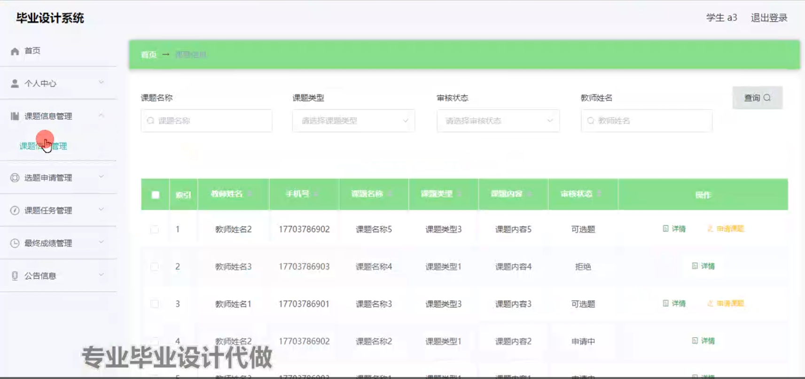

教师端课程任务管理

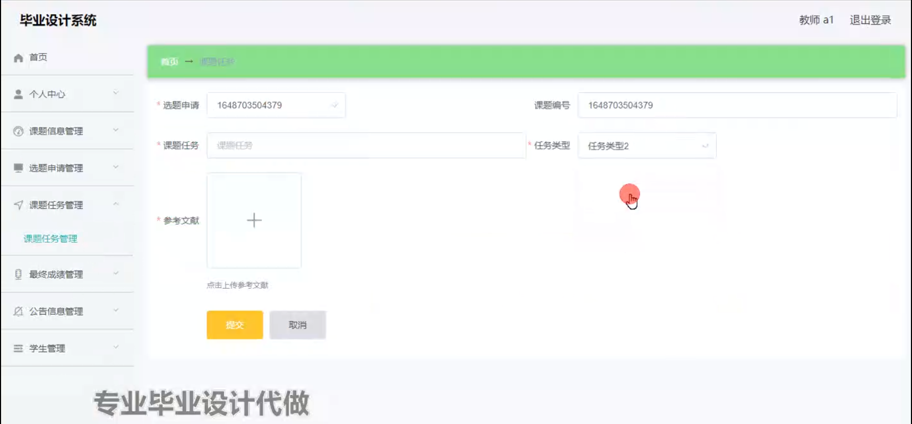

课程任务管理

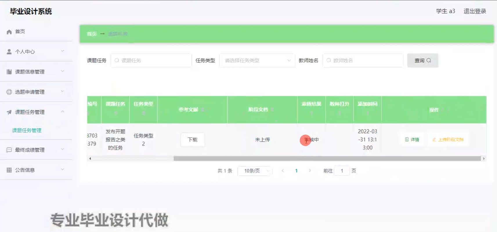

最终成绩管理

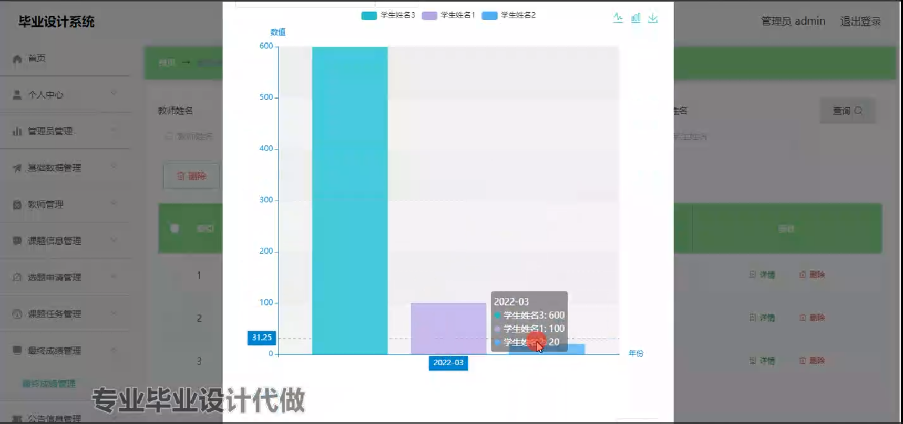

公告信息管理

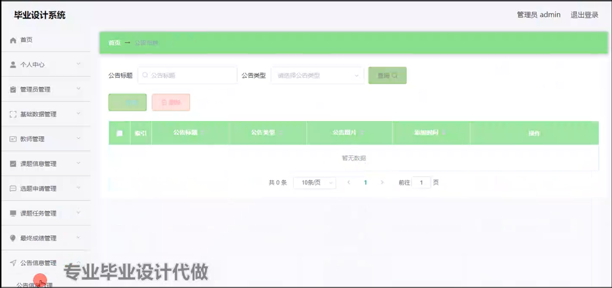

#### 总结

在当前高等教育体系中，毕业设计作为检验学生综合能力的重要环节，其管理和执行效率的提升具有重要意义。本研究针对传统毕业设计管理中存在的问题，开发了一个基于Spring Boot的毕业设计管理系统。该系统通过信息化手段，实现了毕业设计全过程的精细化管理，提高了管理效率，保证了数据的准确性和实时性。

本系统在设计和开发过程中，充分考虑了管理端、教师端和学生端的不同需求，提供了丰富的功能模块和友好的用户界面。通过实际应用，该系统已经取得了显著的效果，得到了广大师生和管理人员的一致好评。未来，我们将继续完善系统功能，提升用户体验，为毕业设计管理提供更加全面和高效的支持。

#### 使用说明

创建数据库，执行数据库脚本 修改jdbc数据库连接参数 下载安装maven依赖jar 启动idea中的springboot项目

后台登录页面
http://localhost:8080/biyeshejixitong/admin/dist/index.html

管理员				账户:admin 		密码：admin

教师				账户:a1 		密码：123456

学生				账户:a1 		密码：123456